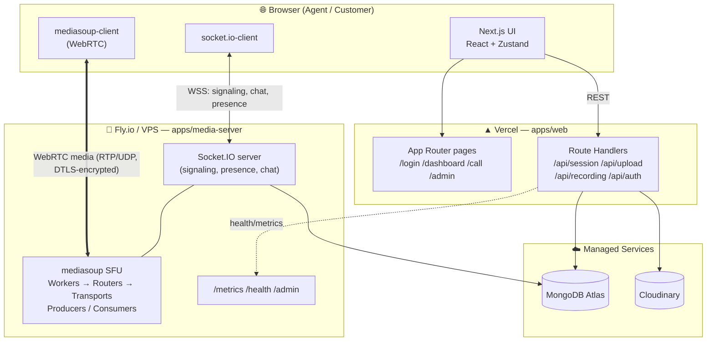
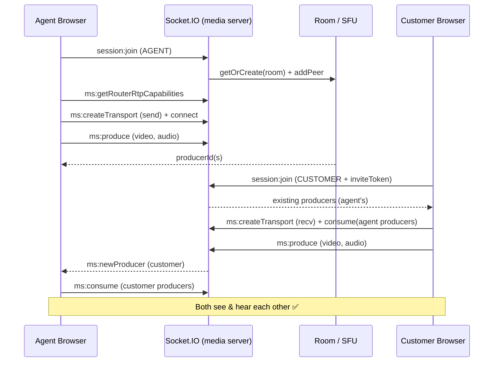

# SupportVision — Architecture

## 1. Overview

SupportVision is a **video-first customer support platform** where media is routed through a **self-hosted Selective Forwarding Unit (SFU)** built on mediasoup. The system is split into two independently deployable services plus shared packages, because the two halves have fundamentally different runtime needs.

| Service | Runtime need | Deploy target |
|---|---|---|
| **Web app** (`apps/web`) | Stateless HTTP/SSR | Vercel (serverless) |
| **Media server** (`apps/media-server`) | Persistent process, **raw UDP**, in-memory room state | Fly.io / VPS |

A serverless platform cannot host the SFU (no persistent process, no UDP), which is exactly why the split exists.

---

## 2. High-Level Diagram



> The **live call media never touches Vercel.** The browser sends/receives RTP directly to the mediasoup SFU over UDP. Vercel only serves the UI and handles REST (auth, session CRUD, uploads).

---

## 3. The SFU Model (why it's compliant)

The challenge forbids third-party hosted video APIs and requires media to "route through your own server." mediasoup is an SFU **library** we run inside our own Node process:

```
Customer ──RTP/UDP──▶  [ our mediasoup Router ]  ──RTP/UDP──▶  Agent
   (Producer)              forwards streams              (Consumer)
```

- Each participant **produces** their audio/video to the server.
- The server **forwards** (selectively) to other participants who **consume** it.
- No peer-to-peer connection between browsers; no external media service.
- Media is DTLS-SRTP encrypted; the SFU only forwards packets.

**Key classes** (`apps/media-server/src/mediasoup/`):
- `WorkerPool` — spawns N mediasoup workers (CPU cores), round-robins routers across them.
- `Room` — one per session: owns a Router, per-peer WebRTC transports, producers, consumers, and the reconnect grace timer.
- `RoomManager` — session-id → Room registry, with **concurrent-create de-duplication** (so duplicate joins can't spin up two routers for one session).

---

## 4. Call Setup Sequence



---

## 5. Data Model (MongoDB)

```mermaid
erDiagram
    USER ||--o{ SESSION : creates
    SESSION ||--o{ PARTICIPANT : has
    SESSION ||--o{ MESSAGE : has
    SESSION ||--o{ FILE : has
    SESSION ||--o| RECORDING : has

    USER { string name; string email; string passwordHash; string role }
    SESSION { string name; string customerName; string customerPhone; string agentId; string inviteToken; enum status; date startedAt; date endedAt; int duration }
    PARTICIPANT { string sessionId; string userName; enum role; string socketId; date joinedAt; date leftAt; bool isActive }
    MESSAGE { string sessionId; string sender; enum senderRole; enum type; string content; string fileUrl }
    RECORDING { string sessionId; string recordingUrl; enum status; int duration; int fileSizeBytes }
    FILE { string sessionId; string fileName; string fileType; string cloudinaryUrl; string uploadedBy }
```

---

## 6. Realtime Events (Socket.IO, typed)

Defined in `packages/socket-events` and shared by client & server for end-to-end type safety.

| Domain | Client → Server | Server → Client |
|---|---|---|
| Session | `session:join`, `session:leave`, `session:end` | `user:joined`, `user:left`, `user:reconnected`, `session:ended` |
| Mediasoup | `ms:getRouterRtpCapabilities`, `ms:createTransport`, `ms:connectTransport`, `ms:produce`, `ms:consume`, `ms:resumeConsumer` | `ms:newProducer`, `ms:producerClosed` |
| Chat | `chat:send` | `chat:receive`, `chat:history` |
| Recording | `recording:start`, `recording:stop` | `recording:statusUpdate` |

---

## 7. Recording Pipeline (client-side)

```
Agent clicks Record
  → recording:start (server creates Recording doc = PROCESSING)
  → browser draws local + remote video onto a <canvas>,
    mixes all audio via Web Audio API → one MediaStream
  → MediaRecorder captures to a WebM Blob
Agent clicks Stop
  → POST /api/recording/upload (multipart) → Cloudinary (resource_type: video)
  → Recording doc = READY (+ url)
  → recording:stop broadcasts READY to the room → download link appears
```

This keeps the **live call** on the SFU while recording captures the composited result — fully compliant, and far more robust than server-side FFmpeg RTP plumbing on constrained hosts.

---

## 8. Reliability & Access Control

- **Reconnect grace (60s):** on disconnect, the peer is marked `disconnectedAt` and a timer starts; a rejoin with the same identity within the window restores the seat silently. After expiry, the peer is treated as left.
- **Single-customer capacity:** a second distinct customer is rejected ("session already in use"); the original can still reconnect/refresh.
- **RBAC:** agents authenticate via NextAuth (JWT); customers require a valid `inviteToken`. Recording and session-end are server-checked to be **agent-only**.
- **Duplicate-join safety:** `RoomManager.getOrCreate` de-dupes concurrent room creation.

---

## 9. Scalability Notes

- mediasoup scales with **workers per CPU core**; rooms are distributed across workers via `WorkerPool`.
- Multiple concurrent sessions are isolated — one `Room` (Router) per session.
- Horizontal scale would add a Socket.IO adapter (e.g. Redis) and a routing layer to pin a session to a media-server instance; the current design targets single-instance deployments suitable for the hackathon scope.
